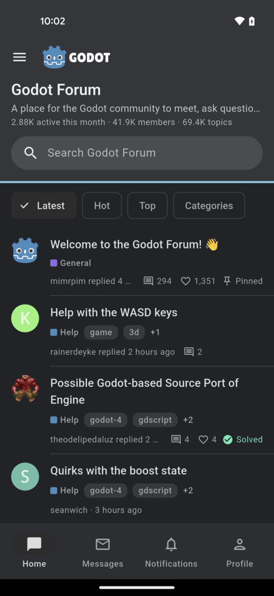
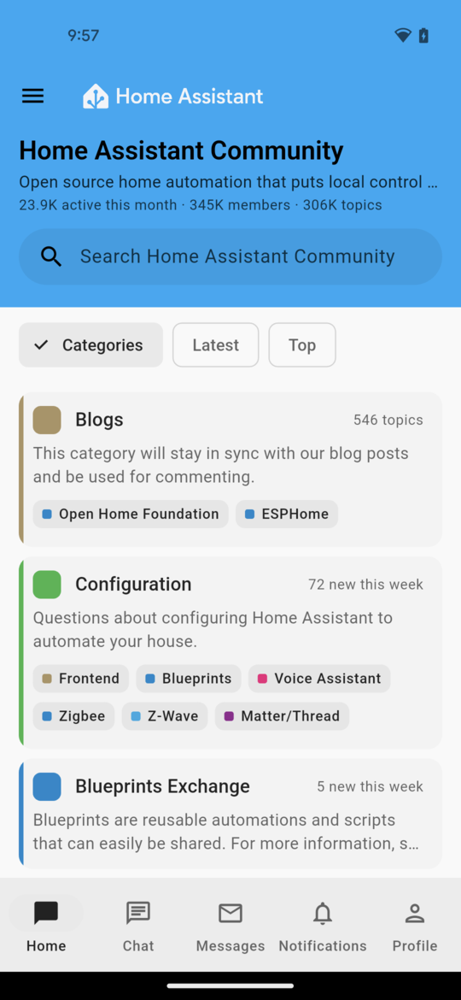
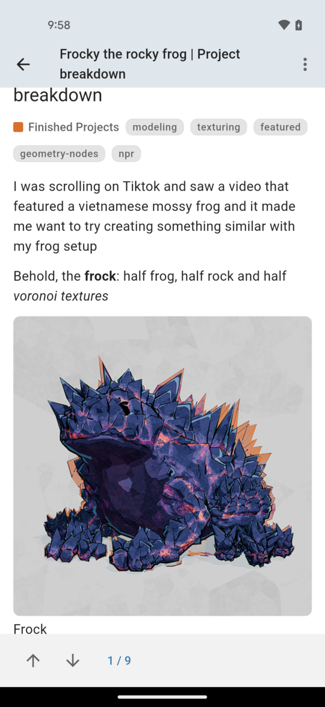
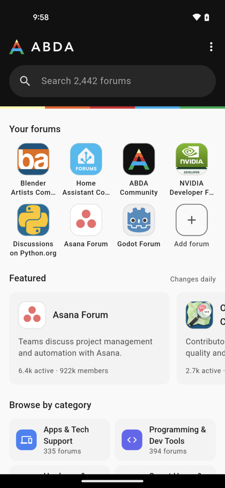

# Discourse App

[](https://github.com/forumcopilot/discourse-app/actions/workflows/ci.yml)

An open-source Flutter app template for a **single Discourse community**.

Point it at your forum's URL, build it, ship it under your community's name. It talks to Discourse's **stock REST/JSON API** using **User API Keys** — the same mechanism Discourse's own official app uses. There is **no server-side plugin to install**, no admin API key to hand out, and nothing to run alongside your forum.

Built and tested on Android, iOS and macOS. Flutter 3.32 or newer (CI builds with 3.38.7), Dart `^3.6.1`. MIT licensed.

**[Use this template](https://github.com/forumcopilot/discourse-app/generate)** to start your own app — or [have it built for you](#need-it-built-for-you).

<p align="center">
  
  &nbsp;
  
  &nbsp;
  
  &nbsp;
  
</p>
<p align="center"><sub>First three: this app inside <a href="https://betterdiscourse.app">ABDA</a> on Godot Forum, Home Assistant Community and Blender Artists, each in its own forum's logo and colours. Last: ABDA's own home, the forum chooser that wraps this code.</sub></p>

## Try it without building anything

**[ABDA – A Better Discourse App](https://betterdiscourse.app)** is this project shipped as a product: the exact screens in this repo, plus a directory of 2,400+ public Discourse forums to open them against. Open your own forum in it by address and you are looking at what this template gives your community — minus the forum chooser, plus your name and icon. Get it on [Google Play](https://play.google.com/store/apps/details?id=com.forumcopilot.abda); the App Store version is coming soon, and until then the quick start below builds the same thing for iPhone.

---

## Quick start

**Prerequisites:** Flutter 3.32 or newer, plus Xcode (iOS/macOS) and/or Android Studio for the platforms you target.

**1. Get your own copy.** Click **[Use this template](https://github.com/forumcopilot/discourse-app/generate)** → *Create a new repository*. You get a repository of your own — private if you like — that starts from a single commit, then clone it:

```bash
git clone https://github.com/<you>/<your-app>.git
cd <your-app>
```

A template copy shares no history with this repository, so later releases can't simply be merged into it. If you want to keep pulling them in, clone this repository instead, rename its remote with `git remote rename origin upstream`, and push to a repository of your own; `git pull upstream main` then brings in each release like any other merge.

**2. Build and run.** Out of the box the app opens [try.discourse.org](https://try.discourse.org), Discourse's public sandbox.

```bash
flutter pub get
./buildlib.sh          # resolves the nested packages, codegen, gen-l10n   (Windows: buildlib.bat)

# Android / iOS / macOS builds require a Firebase config file to *exist*,
# even with push disabled. The committed .example placeholders are enough
# to compile — copy them, and replace with real ones only if you wire push.
cp android/app/google-services.json.example        android/app/google-services.json
cp ios/Runner/GoogleService-Info.plist.example     ios/Runner/GoogleService-Info.plist
cp macos/Runner/GoogleService-Info.plist.example   macos/Runner/GoogleService-Info.plist

flutter run -d macos   # or -d <ios-device>, -d <android-id>
```

The three files above are gitignored, so your real ones can never be committed by accident.

The project also carries Flutter's web, Windows and Linux runners. They skip Firebase and need no config file, but they are not tested, and a web build can only reach a forum that allows its origin in Discourse's CORS settings.

**3. Point it at your forum** (next section), then work through [Before you publish your app](#before-you-publish-your-app).

### Point it at your forum

Edit `packages/discourse_ui/lib/config/app_forum_config.dart`:

```dart
static const String forumName    = 'My Community';
static const String forumBaseUrl = 'https://forum.example.com';

/// Shown on your forum's grant page ("… would like to access your account")
/// and later in the user's Preferences → Security → Apps.
static const String defaultUserApiApplicationName = 'My Community';
```

That's the minimum. Optional: `forumDescription`, `logoUrl`, `defaultUseForumColors` (`false` keeps your own brand colours instead of the forum's), `defaultPushApiBaseUrl` / `defaultNotificationsApiBaseUrl` (push, see [docs/push.md](docs/push.md)), and the Android passkey identifiers (`androidPackageName`, `androidSha256CertFingerprint`).

The sign-in redirect defaults to `discourse://auth_redirect` — the scheme every Discourse instance already allowlists, so the handshake works against any forum without an admin changing settings. To use your own scheme instead, set `userApiAuthRedirect`, have the forum admin add it to `allowed_user_api_auth_redirects`, and change the scheme on `flutter_web_auth_2`'s `CallbackActivity` in `android/app/src/main/AndroidManifest.xml` to match.

### Codegen

`buildlib.sh` resolves each nested package (`dart pub get` in each — root `flutter pub get` does not do this, and skipping it leaves the analyzer with hundreds of unresolved imports), runs `build_runner` inside `packages/forumcopilot_sdk`, then `flutter gen-l10n`. **Re-run it after** editing an ARB file or any `dart_mappable` / `json_annotation` annotated class in the SDK. The SDK is the only package with generated code.

### Release build

```bash
flutter build appbundle   # Google Play; or ipa (App Store), apk, macos
```

---

## Before you publish your app

Everything that identifies the app is a placeholder. The checked-in values build and run against the Discourse sandbox, and nothing more; a store will reject `com.example`, and "Forum App" is not a name. Change all of these:

| What | Where | Placeholder today |
|---|---|---|
| Forum URL, name, description, branding | `packages/discourse_ui/lib/config/app_forum_config.dart` | `https://try.discourse.org`, `Discourse` |
| Name on the sign-in grant page | `AppForumConfig.defaultUserApiApplicationName`. Readers see it when they authorize the app and afterwards in Preferences → Security → Apps, and keys already granted keep the old name, so set it before launch | `Discourse Mobile` |
| Android application id and namespace | `android/app/build.gradle` (`applicationId`, `namespace`), and move `android/app/src/main/kotlin/com/example/forumapp/MainActivity.kt` to the matching package path | `com.example.forumapp` |
| Android app name | `android/app/src/main/AndroidManifest.xml` (`android:label`) | `Forum App` |
| iOS bundle id, display name | `ios/Runner.xcodeproj` (`PRODUCT_BUNDLE_IDENTIFIER`, three configurations), `ios/Runner/Info.plist` (`CFBundleDisplayName`, `CFBundleName`) | `com.example.forumapp`, `Forum App` |
| macOS bundle id, product name, copyright | `macos/Runner/Configs/AppInfo.xcconfig` (`PRODUCT_BUNDLE_IDENTIFIER`, `PRODUCT_NAME`, `PRODUCT_COPYRIGHT`) | `com.example.forumapp`, `Forum App`, `com.example` |
| Package name the passkey / app-link config refers to | `AppForumConfig.androidPackageName`, plus your hosted `assetlinks.json` and `apple-app-site-association` with your team id and certificate fingerprints | `com.example.forumapp` |
| Icons and splash | `assets/`, then `dart run flutter_launcher_icons` and `dart run flutter_native_splash:create` | Forum Copilot artwork |
| Apple Development Team | Xcode signing settings | none |
| Firebase, only if you wire push | your own `google-services.json` / `GoogleService-Info.plist` in place of the `.example` placeholders; **never commit a service-account JSON** | placeholders |
| Web, Windows, Linux, only if you ship them | `web/manifest.json` and `web/index.html`; `windows/runner/Runner.rc`; `linux/CMakeLists.txt` (`APPLICATION_ID`), and `BINARY_NAME` in both CMake files | `Forum App`, `com.example`, `com.example.forumcopilot_flutter` |
| Local dev helper | `reset_storage.sh` (`BUNDLE_ID`) | `com.example.forumapp` |

### Naming

This project is not affiliated with, endorsed by, or an official product of Civilized Discourse Construction Kit, Inc. "Discourse" is their trademark. Your app should be named for the community it serves, not as "the Discourse app", and its store listing should say it is a third-party client.

---

## What works today

<details open>
<summary><b>Browsing &amp; reading</b></summary>

- **Home** — the forum's own header (its logo, header colours, description, activity and a search field) over its own navigation bar (`top_menu`): Latest, Hot, New, Unread, Top and Categories in the forum's order, opening on its homepage, with New and Unread counts. Top has a period selector.
- **Categories** — a card per category with the mark the forum set (uploaded logo, icon, emoji or colour), its description, "N new this week", new and unread counts, and subcategories. A category's page has a header tinted in its colour, its notification level, and Latest / Hot / New / Unread.
- **Drawer** — the forum's map, like the web's sidebar: My posts, Users, Groups, Badges and About, then your own sidebar categories and tags (or the forum's defaults).
- **Read state as on the web** — a dot for new topics, a count for unread replies, titles that step back only once read to the end, Dismiss new and Dismiss unread, and lists that update live when you read on another device.
- **Topic view** — the cooked post HTML (see *How it works*), opening after the last post you read; status icons on the title with Discourse's explanations; the topic map under the first post; the post's actions in one row as on the web; vote arrows on post-voting topics; share and copy link with the forum's own address.
- **Tags** — chips on topic rows, tag-filtered lists, and a Tags directory with search and popularity/alphabetical sort.
- **Polls** — vote (ranked-choice included), change or remove a vote, results and voters, in topics and in messages.
- **Suggested and related topics** (related from discourse-ai) after the last post, as ordinary topic rows.
- **Solved** (`discourse-solved`) — the accepted answer under the question, and marking one where the forum allows it.
- **Appearance** — System default, Light or Dark.
</details>

<details>
<summary><b>Writing</b></summary>

- **Markdown composer** — Discourse-flavored Markdown, the only markup Discourse actually cooks, in full-screen forms for New Topic, Reply, Quote, Edit and New Message. Closing one with unsaved writing asks first, in Discourse's words.
- New topic with category and tags; reply (linked to the post it answers), quote, edit, delete; staff whispers and wiki posts.
- **Uploads go where you are writing**, as on the web: a placeholder at the cursor that becomes Discourse's Markdown when the upload lands. Photos, videos, audio and files from the gallery, the file picker or the camera; three or more photos make a `[grid]`; photos are shrunk the way the forum's own web composer would, and one still over the size limit offers to resize.
- **Server-side drafts** — replies, new topics and new messages round-trip through `/drafts.json`, so a draft started in the app continues in the web composer and vice versa.
- **Post revisions** — view a post's edit history.
</details>

<details>
<summary><b>Social &amp; account</b></summary>

- **Reactions** (`discourse-reactions`) as on the web: a react button that shows your reaction (tap to like or undo, long-press for the forum's own emoji set) beside a summary of who reacted, per emoji, updating live while you read.
- **User cards** — tapping a name or avatar opens the person's card over the page: bio, status, local time, featured badges, and Message, Chat or Profile where the forum allows.
- **The Profile tab is your account** — My posts (your activity, filtered as the web's tabs are, with posts waiting for approval), Drafts, Bookmarks, Badges, Invites, notification settings, Do not disturb and Appearance.
- **Edit profile** — whatever the forum lets you change: picture (a new photo, letter avatar, Gravatar or an earlier upload), cover and card background, name, About me, location, website, title, flair, primary group, featured topic, the forum's own profile questions, time zone, birthday, hiding the profile; and a **status**, which can pause notifications.
- **Bookmarks** with reminders, labels, pins and search; **follow** (`discourse-follow`); **mute and ignore** people.
- **Notifications** — the full `/notifications.json` feed, saying who did what for every type, filterable to Unread.
- **Notification levels** — Watching / Tracking / Normal / Muted on topics, categories and tags, with Discourse's reason for the current one.
- **Account** — change email and password, ignored users, and Delete account where the forum allows members to.
</details>

<details>
<summary><b>Messages &amp; chat</b></summary>

- **Private messages** open in the topic page and get everything a topic post has (reactions, bookmarks, polls, edit history), plus participants, Invite and Remove, Archive (also a swipe) and Leave. The lists are Inbox, Unread, New, Sent and Archive, and each group inbox, with counts kept live the way the web counts them.
- **Chat** (`discourse-chat`), live over MessageBus: channels and DMs with unread badges and starred chats first, Browse channels to find and join more, group chats, threads and My Threads, chat search, each conversation's settings (notifications, mute, members, leave), and every message action (reactions, reply, edit, copy, bookmark, pin, flag). The composer has @ and # suggestions, "is typing…", photos and files, and drafts kept on the forum.
</details>

<details>
<summary><b>Search &amp; moderation</b></summary>

- **Search** — free text plus a structured filter sheet: status (`open` / `closed` / `solved` / `unsolved` / `noreplies` / `archived`), personal scopes (`in:bookmarks` / `in:likes` / `in:posted` / `in:watching` / `in:messages` / …), tags, and sort order.
- **Flags** — the forum's own flag types, in its order and language.
- **Moderation** (staff only) — Pin Topic… (in its category or globally, until a date), close, archive, unlist, rename, delete and undelete, move, merge, suspend and silence, Delete spammer, and the review queue with Discourse's own actions.
</details>

<details>
<summary><b>Push notifications</b> (optional)</summary>

Off by default; see [docs/push.md](docs/push.md). With a backend configured, readers turn notifications on from a page that shows what they will get, and choose per kind (replies and mentions, messages and chat, likes and reactions, everything else), each with its own Android channel. Chat direct messages are included, Do not disturb is respected, and a tap opens what the notification is about.
</details>

<details>
<summary><b>Localisation</b></summary>

ARB-based, English template at `packages/discourse_ui/lib/l10n/app_en.arb`, with de / es / fr / it / ja / ko / nl / pt / ru / zh, using Discourse's own translation wherever Discourse has the string. Terminology is Discourse's — *Topic*, *Category*, *Watching*, *Flag*, *Solution*.
</details>

---

## Not yet implemented

- **Push backends** — the app's side is complete in two forms, but neither server is in this repo: a relay that forwards Discourse's own pushes to FCM/APNs (it needs the forum's admin to allowlist it), or a notifications-grant backend that polls the forum for each reader (it needs nothing from the forum, and is how ABDA's push runs in production). [docs/push.md](docs/push.md) is the contract for both. Push delivery for your app is part of what [Forum Copilot sets up](#need-it-built-for-you).
- **Markdown preview in the composer** — the editor is text-only for now.
- **More of Discourse's plugins** — calendar events and Assign's notices already display, but creating events, assigning, Templates and Cakeday are not there. Each follows the same recipe as reactions and post voting: typed model, proxy method, small UI.

---

## How it works

Three layers, each replaceable:

```
┌──────────────────────────────────────────────────────────────┐
│  lib/main.dart          thin runner: init, then runApp()      │
├──────────────────────────────────────────────────────────────┤
│  packages/discourse_ui  every screen, controller and widget   │
│                         + app_forum_config.dart  ← you edit   │
├──────────────────────────────────────────────────────────────┤
│  packages/forumcopilot_sdk    forum-agnostic contracts        │
│                         IFC*Proxy interfaces, FC* entities    │
├──────────────────────────────────────────────────────────────┤
│  packages/discourse_core      the Discourse implementation    │
│                         REST + MessageBus, JSON → FC* entities│
└──────────────────────────────────────────────────────────────┘
                              ↕ HTTPS
                        your Discourse forum
```

**Configuration is compile-time.** `AppForumConfig` in `packages/discourse_ui/lib/config/app_forum_config.dart` holds the forum URL, display name, and branding. There is no runtime forum picker — that is the point of a single-forum app. (The same packages can also be mounted by a multi-forum host through `DiscourseHost`; that is how ABDA uses them.)

**Authentication is Discourse's User API Key handshake.** On first sign-in the app generates an RSA-2048 keypair and opens your forum's own `/user-api-key/new` page in the system's browser sign-in sheet — ASWebAuthenticationSession on iOS and macOS, Chrome's Auth Tab on Android — as Discourse's official app does. The user signs in there with whatever your forum already uses (password, 2FA, passkey, Google, SSO), their password manager fills it as it would in the browser, and someone already signed in to the forum in the browser only taps Authorize. Discourse returns an encrypted payload; the app decrypts it with its private key and keeps the resulting API key in the platform's secure storage. **The app never sees the user's password.** No plugin, no OAuth app registration, no admin token. Platforms without the sheet fall back to an in-app web view.

**Data flows through a proxy layer.** UI code never calls HTTP directly — it asks `SiteProxyFactory` for a typed proxy (`getTopicProxy()`, `getPostProxy()`, …) and gets back the `discourse_core` implementation. Each proxy calls stock Discourse endpoints and converts the JSON into the SDK's `FC*` entities. Responses share one shape: `FC*Result { result, resultText, …payload }`. What Discourse says that the shared SDK has no field for — read state, message counts, chat threads, the forum's reaction set — is kept per forum in `discourse_core` side stores, fed by the same payloads.

**Live updates come over MessageBus**, as on Discourse's web client: while a screen needs them, the app long-polls `/message-bus` for chat messages, edits and reactions, a topic's reactions, reading done on another device, and message counts. It stops in the background, to stay within the User API Key's request budget.

**Posts render as Discourse renders them.** Discourse cooks Markdown to HTML server-side and serves it in the post stream's `cooked` field. The app renders that HTML with `flutter_html`, plus native widgets for what the web draws with CSS or JavaScript: tables, link previews, polls, spoilers, local dates in the reader's time zone, maths, calendar events, highlighted code, image grids and moderator-action notices. A phone app does not run third-party iframes, so YouTube, Vimeo, Spotify and other embeds become preview cards that open the site or its app. Links into the same forum open on the app's own screens.

**It wears the forum's colours.** The forum's light and dark colour schemes (from `/site.json`) become the app's theme, applied the way Material 3 uses a brand colour: the accent on buttons and links, darkened only as far as text needs to stay legible, and the page kept neutral. The forum's header colours and logo lead its home, and categories wear their own colour and mark wherever they are named. Readers choose Light, Dark or the device setting, and forum pages in web views follow. An app with its own brand turns this off with `AppForumConfig.useForumColors`.

**State is GetX** (`Get.put` / `Obx`), navigation goes through a `globalNavigatorKey` so SDK code can raise dialogs (e.g. a Cloudflare challenge) without a `BuildContext`.

---

## Local development against Discourse

Clone Discourse locally and seed it with demo content:

```bash
git clone https://github.com/discourse/discourse.git /path/to/discourse
cd /path/to/discourse
bin/dev                                    # boots Discourse on localhost:4200

# in another shell — idempotent, safe to re-run:
cd /path/to/discourse-app
./scripts/seed_demo.sh                     # or: DISCOURSE_DIR=/elsewhere ./scripts/seed_demo.sh
```

`scripts/seed_discourse_demo.rb` creates 10 users across every trust level (`alice` TL3, `bob` TL2, `carol` TL1, `dave` TL0, `eve` TL4, `mallory` moderator, plus four more; password `demo-password-1234!` for all), 3 categories, 13 tags, ~16 topics covering every state (open, closed, archived, unlisted, pinned, solved, polls, Q&A), ~90 posts, likes, reactions, votes, bookmarks, drafts, badges, 6 PMs, and 5 chat channels. Sign in as `alice` for the fullest view.

Set `forumBaseUrl = 'http://localhost:4200'` to point the app at it. For a physical Android device over USB, `adb reverse tcp:4200 tcp:4200` first.

---

## Repository layout

```
lib/
└─ main.dart                              # init + push bootstrap, then ForumCopilotApp

packages/discourse_ui/                    # the entire UI layer
├─ lib/config/app_forum_config.dart       # ← the file you edit for your forum
├─ lib/controllers/                       # GetX controllers
├─ lib/views/                             # pages + widgets
├─ lib/services/                          # init, sign-in, push, links, forum theme
├─ lib/host/                              # DiscourseHost: hooks for multi-forum hosts
├─ lib/utils/                             # cooked-HTML extraction, URLs, time, files
├─ lib/core/                              # logging, errors, cache, memory
├─ lib/theme/                             # design tokens, Material 3 theme, forum colours
└─ lib/l10n/                              # ARB files + generated localisations

packages/forumcopilot_sdk/                # forum-agnostic contracts
├─ lib/interfaces/                        # IFC*Proxy
├─ lib/models/                            # FC* entities + FC*Result wrappers
└─ lib/factory/                           # SiteProxyFactory

packages/discourse_core/                  # the Discourse implementation
├─ lib/factory/                           # DiscourseProxyFactory
├─ lib/src/proxy/                         # per-area proxies (Topic, Post, Search, Chat, …): REST → FC*
├─ lib/src/data/                          # per-forum side stores: read state, chat, messages, site
├─ lib/src/network/                       # Dio client, User API Key handshake, MessageBus
└─ lib/src/util/                          # Discourse links, HTML text, quotes, site URLs

packages/discourse_appearance/            # plugin: in-app light/dark → native UI + web views

scripts/                                  # local dev helpers (demo seeding)
docs/guides/                              # platform setup notes (icons, splash, macOS picker)
CLAUDE.md                                 # codebase guide for AI coding tools
```

---

## Extending it

The `forumcopilot_sdk` interface was originally shaped around XenForo. Where Discourse has a concept that doesn't map cleanly, the rule is: **extend the SDK to express the Discourse concept** — don't bend Discourse to fit the old shape, and don't reach for a server plugin to paper over the gap.

Order of preference:

1. Extend the SDK interface to express the Discourse concept directly.
2. Surface it as a Discourse-specific feature in the app.
3. Lossy-map at the converter layer — last resort only.

Concepts that took route 1 and are now first-class: tags, polls, bookmarks, four-level notification levels, structured search filters, server-side drafts, emoji reactions, post voting, suggested topics, badges, trust levels, accepted answers, and chat.

Facts only Discourse has, which no other forum platform would fill in, stay out of the shared SDK: they live in `discourse_core` as per-forum side stores that the proxies record into from every payload — `DiscourseTopicTracking` (Discourse's TopicTrackingState), `DiscourseMessageTracking`, `DiscourseChatChannelDetails`, `DiscourseValidReactions`, `DiscourseSiteCapabilities` and others.

**To add a feature:** update the interface in `packages/forumcopilot_sdk/lib/interfaces/`, add or extend the entity in `models/`, implement it in `packages/discourse_core/lib/` (the proxy calls Discourse and converts its JSON), re-run codegen, then build the UI in `packages/discourse_ui/`. The SDK here is a vendored copy of a canonical one shared with other apps; [CONTRIBUTING.md](CONTRIBUTING.md) says how to change it.

---

## Changelog

See [`CHANGELOG.md`](CHANGELOG.md). It follows *Keep a Changelog*; the **[Unreleased]** section is what has landed since the last tagged release. Each tagged version also has a [GitHub Release](https://github.com/forumcopilot/discourse-app/releases) with the same notes.

---

## Contributing

Issues and pull requests are welcome — see **[CONTRIBUTING.md](CONTRIBUTING.md)** for how to get a build running, what to check before a PR, and the two rules that are easy to trip over (the vendored SDK, and preferring Discourse's native concepts). The project follows a [Code of Conduct](CODE_OF_CONDUCT.md).

To contribute, **fork** this repository rather than using the template: a pull request needs the shared history that a template copy starts without.

For a larger Discourse-native feature, please open an issue first so we can agree on whether the SDK interface should be extended rather than lossily mapped — see *Extending it* above.

Working with Claude Code or another AI coding tool? Point it at `CLAUDE.md` first; it documents the conventions and the current state of each layer.

---

## Need it built for you?

The code is free so you can see exactly what you would be getting. Most communities that adopt it do not want to run a Flutter toolchain — they want it done. That work is what we sell, and it is not limited to forum apps:

- **Your forum's app** — name, icon, colours, splash, store listings, and the App Store and Play Store submissions handled end to end.
- **Features this repo does not have** — a screen for your plugin, single sign-on with your existing accounts, paywalled categories, in-app purchases, offline reading, whatever your community actually needs.
- **Push notifications** — the app's side is finished; we run the backend that delivers them ([docs/push.md](docs/push.md) has the details).
- **Beyond forums** — the same team builds and ships Flutter apps generally. If you have a mobile product in mind that is not a forum at all, we are happy to talk.

See [what a custom build covers](https://betterdiscourse.app/#custom). **Get in touch: [forumcopilot@gmail.com](mailto:forumcopilot@gmail.com)** — say what community or product it is for and roughly what you want, and you will get a real reply, usually the same day.

Build it yourself under the MIT license, or hand it to us — both are fine.

### Part of Forum Copilot

This app comes out of **[Forum Copilot](https://forumcopilot.com)**, a service that builds and ships white-label mobile apps for forum communities — branding, app-store releases, and push delivery handled for you.

| Project | Backend | Source |
|---|---|---|
| **discourse-app** *(this repo)* | Discourse | [github.com/forumcopilot/discourse-app](https://github.com/forumcopilot/discourse-app) |
| **xenforoapp** | XenForo (via the Forum Copilot add-on) | [github.com/forumcopilot/xenforoapp](https://github.com/forumcopilot/xenforoapp) |
| **ABDA** | Discourse — this app mounted for any forum, with a directory | [betterdiscourse.app](https://betterdiscourse.app) |
| **ForumCopilot.com** | Hosted SaaS — multi-forum, push relay, white-label builds | [forumcopilot.com](https://forumcopilot.com) |

This repo is the Discourse-native sibling of `xenforoapp`: same UI shell, same SDK shape, but the data layer speaks Discourse REST instead of an XF plugin.

---

## License

MIT — see [LICENSE](LICENSE).
